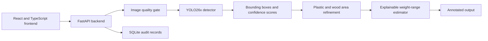

# Automated Organic Resource and Mass Quantification System

Python and React application for detecting waste materials with an
Ultralytics YOLO model, estimating approximate material weight, and recording
private input/output audit evidence.

## System Architecture



The public repository contains the complete source code, configuration, and
documentation. Datasets, trained checkpoints, generated audit records, logs,
and build outputs are excluded because they are large or contain local runtime
data.

## Project Structure

```text

  configs/
    full_dataset_yolo.yaml
    materials.yaml
  datasets/
    full_dataset/
    oiv7_material_subset/
  models/
    final.pt
    args.yaml
    results.csv
  tools/
    audit_logs.py
    calibrate_materials.py
    evaluate_yolo.py
    run_web.py
    train_yolo.py
  src/
    core_inference/
      area_refinement.py
      config.py
      estimator.py
      types.py
    api_service/
      database.py
      inference.py
      main.py
      quality.py
      schemas.py
      settings.py
  web/
    frontend/
      src/
      dist/
  requirements.txt
  start_app.ps1
```

## Installation

```powershell
python -m venv .venv
.\.venv\tools\Activate.ps1
pip install -r requirements.txt
```

Build the frontend before starting the application:

```powershell
cd web\frontend
npm install
npm run build
cd ..\..
```

## Run The Application

Place a compatible trained checkpoint at `models/final.pt`, then run:

```powershell
.\start_app.ps1
```

Open:

```text
http://127.0.0.1:8000
```

The application supports:

- multiple image uploads
- image resolution, blur, contrast, and exposure validation
- confidence threshold control
- YOLO material detection
- annotated output images
- refined plastic and wood occupied-area estimates
- object, image, and pile expected weight ranges
- SQLite input/output audit records
- searchable run history with input/output previews
- rerunning a previous inspection with a new confidence threshold
- collapsible desktop navigation with a persistent expanded/collapsed preference
- SQLite-backed operations dashboard with lifetime, daily, trend, material-mix,
  success-rate, image-volume, and runtime metrics

The sidebar separates the operator workflow into:

- **Inspection** for new image uploads and detection
- **Run history** for previous records, findings, and reruns
- **System** for inspection activity, detected-object trends, material mix, and
  runtime readiness

## Runtime Files

The website uses:

```text
models/final.pt
configs/full_dataset_yolo.yaml
configs/materials.yaml
web/frontend/dist/
tools/run_web.py
src/core_inference/
src/api_service/
```

Runtime data is generated automatically under:

```text
data/uploads/
data/outputs/
data/audit/audit.db
```

## Dataset

The main YOLO dataset is:

```text
datasets/full_dataset
configs/full_dataset_yolo.yaml
```

Current YOLO split sizes:

```text
train: 35,877 images, 259,091 objects
val:    5,036 images,  42,466 objects
test:   4,739 images,  28,615 objects
total: 45,652 images, 330,172 objects
```

The June 22, 2026 merges added selected, remapped detection data from:

```text
CylinDeRS
YOLO Waste Detection
dataset.zip recycling-belt dataset
TACO
ZeroWaste-f
SteelDS a1 and a2
```

Only annotations that mapped safely to the project classes were included.
Generic garbage labels, classification-only datasets, augmented duplicates,
and datasets without suitable object boxes were excluded. SHA-256
deduplication removed 223 exact duplicates, including 158 duplicates crossing
dataset splits.

SteelDS class 1 (steel) was mapped into the project's `cast_iron`
ferrous-metal bucket. Its YOLO segmentation polygons were converted to
detection boxes. One frame in every 10 consecutive video frames was retained
to reduce temporal redundancy and prevent the ferrous class from dominating
the dataset. Copper annotations were excluded because the project has no
copper class. SteelDS `a4` and `a5` are intentionally unlabeled, and `a3` was
not present in `datasets/raw`, so those archives were not added to supervised
training.

The active `full_dataset_yolo.yaml` points to `datasets/full_dataset`. The
dataset itself is intentionally excluded from this repository because of its
size and the independent terms of its source datasets.

The expanded dataset passed a complete Ultralytics scan with zero corrupt
images. The final YOLO26x checkpoint was then fine-tuned for 10 epochs on this
45,652-image dataset.

Configured classes:

```text
cast_iron
cloth
gas_cylinder
dust
pitted_sheets
left_over_paint
plastics
rubber
tin
water
wood
```

`left_over_paint` remains configured but has no real annotated examples.

## Train YOLO

Train or fine-tune after placing the dataset under
`datasets/full_dataset`:

```powershell
python tools\train_yolo.py --data configs\full_dataset_yolo.yaml --model models\final.pt --epochs 10 --imgsz 640 --batch 5 --workers 8 --project . --name train --final-model models\final.pt
```

Reduce the batch size if CUDA runs out of memory.

The final checkpoint is written to:

```text
models/final.pt
```

## Evaluate YOLO

```powershell
python tools\evaluate_yolo.py --model models\final.pt --data configs\full_dataset_yolo.yaml --split test --imgsz 640 --batch 2
```

## Latest Validation Results

The best result from the 10-epoch final fine-tuning run occurred at epoch 9:

```text
Precision:  0.7970
Recall:     0.6698
mAP50:      0.7486
mAP50-95:   0.5661
```

These are validation metrics, not a claim of industrial field accuracy.
Performance should be measured again on site-specific Tata Steel images before
production use.

## Weight Estimation

Weight estimation uses:

```text
bounding-box area
-> material fill ratio
-> calibrated image area
-> assumed thickness
-> material density
-> estimated weight
```

Material properties are configured in:

```text
configs/materials.yaml
```

Each material also has a `weight_uncertainty_ratio`. The midpoint is calculated
from area, thickness, density, and fill ratio; the website displays the
resulting minimum-to-maximum expected range rather than the midpoint alone.

For plastic and wood detections, the backend first attempts a lightweight
foreground-area refinement inside the YOLO box. When the foreground estimate
is not reliable, material-specific geometry rules reduce the effect of loose
or oversized bounding boxes. The API reports the area method and its
reliability with each detection.

The result is an approximate engineering estimate, not a replacement for an
industrial weighing system. Camera calibration and measured reference samples
are required for operational accuracy.

## Image Quality Gate

Every uploaded image is checked before the model runs. Detection is stopped
when an image is too small, blurred, low contrast, too dark, or overexposed.
The interface shows the rejected filename, quality score, and corrective
reason. Thresholds can be adjusted through:

```text
QUALITY_MIN_DIMENSION
QUALITY_MIN_BLUR_SCORE
QUALITY_MIN_CONTRAST
QUALITY_MIN_BRIGHTNESS
QUALITY_MAX_BRIGHTNESS
```

## Audit History

SQLite stores the original image, annotated output, detections, weight ranges,
quality result, settings, and rerun lineage. Operators can inspect this history
from the website. Existing auditor endpoints remain available for controlled
record access.

## Calibrate Weight Profiles

Record scale measurements in:

```text
calibration/material_measurements.csv
```

Use one row per weighed object or single-material pile. Each row records its
material class, detected box or mask area, physical image scale, and actual
measured weight. Then run:

```powershell
python tools\calibrate_materials.py
```

The script fits a robust per-material `calibration_factor`, estimates an
uncertainty range from observed relative errors, reports MAE/MAPE before and
after calibration, and writes `configs/materials.calibrated.yaml`. See
`calibration/README.md` for the complete collection procedure.

## Auditor Records

```powershell
python tools\audit_logs.py database
python tools\audit_logs.py list --limit 25
python tools\audit_logs.py show <run_id>
python tools\audit_logs.py export <run_id>
```

The auditor API remains disabled unless `WASTE_AUDIT_KEY` is configured.

## Submission

The final detector is Ultralytics YOLO because it provided better practical
performance and faster inference than the earlier Faster R-CNN model. The
surrounding weight-estimation, audit, and web application layers remain
separate from the detector implementation.

## Author

**Niki Nagaraju**
